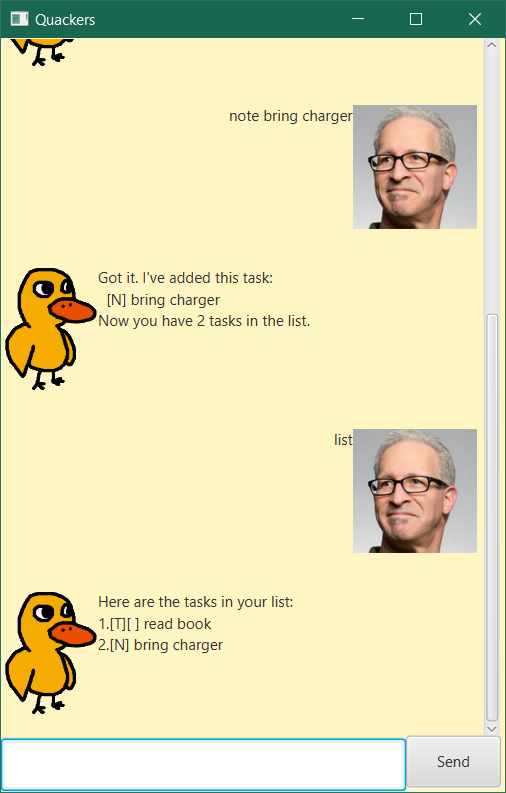

# Quackers User Guide



Quackers is a duck who remembers things so you don't have to. Tell it your to-dos, deadlines,
events and notes by typing short commands into a chat window, and it keeps them in a list that is
saved automatically between sessions. Quack!

- [Quick start](#quick-start)
- [Features](#features)
  - [Adding a to-do: `todo`](#adding-a-to-do-todo)
  - [Adding a deadline: `deadline`](#adding-a-deadline-deadline)
  - [Adding an event: `event`](#adding-an-event-event)
  - [Adding a note: `note`](#adding-a-note-note)
  - [Listing everything: `list`](#listing-everything-list)
  - [Marking a task as done or not done: `mark`, `unmark`](#marking-a-task-as-done-or-not-done-mark-unmark)
  - [Deleting an item: `delete`](#deleting-an-item-delete)
  - [Finding items: `find`](#finding-items-find)
  - [Exiting: `bye`](#exiting-bye)
  - [Saving your data](#saving-your-data)
- [Command summary](#command-summary)
- [Acknowledgements](#acknowledgements)

## Quick start

1. Make sure you have **Java 25** installed. You can check by running `java -version`.
1. Download the latest `quackers.jar` from the
   [Releases page](https://github.com/JavierLimZH/ip/releases).
1. Put the JAR in an empty folder. Quackers saves your data in a `data` folder next to it.
1. Open a terminal in that folder and run `java -jar quackers.jar`. A chat window opens and
   Quackers greets you.
1. Type a command in the box at the bottom and press **Enter** or click **Send**. Try
   `todo read book`, then `list`.

## Features

**Notes about the command format:**

- Words in `UPPER_CASE` are values you supply. In `todo DESCRIPTION`, `DESCRIPTION` could be
  `read book`.
- Command words are lowercase and must be typed exactly: `list` works, `List` does not.
- `N` is an item's number as shown by `list`, starting from 1.
- Each item is shown with a type and, for tasks, a status box:
  `[T]` to-do, `[D]` deadline, `[E]` event, `[N]` note; `[X]` done, `[ ]` not done.

### Adding a to-do: `todo`

Adds a task with no date attached.

Format: `todo DESCRIPTION`

Example: `todo read book`

```
Got it. I've added this task:
  [T][ ] read book
Now you have 1 tasks in the list.
```

### Adding a deadline: `deadline`

Adds a task that must be done by a certain date.

Format: `deadline DESCRIPTION /by DATE`

- `DATE` must be written as `yyyy-MM-dd`, for example `2027-02-28`. Quackers shows it back in a
  friendlier form, `Feb 28 2027`.

Example: `deadline return book /by 2027-02-28`

```
Got it. I've added this task:
  [D][ ] return book (by: Feb 28 2027)
Now you have 2 tasks in the list.
```

If the date is in any other form, such as `28-02-2027`, Quackers replies
`Quack? Use yyyy-MM-dd for the deadline date.` and nothing is added.

### Adding an event: `event`

Adds a task that takes place over a period of time.

Format: `event DESCRIPTION /from START /to END`

- `START` and `END` can be any text, such as `2pm`, `Mon 2pm` or `Aug 6`.
- `/from` must come before `/to`.

Example: `event project meeting /from Mon 2pm /to 4pm`

```
Got it. I've added this task:
  [E][ ] project meeting (from: Mon 2pm to: 4pm)
Now you have 3 tasks in the list.
```

### Adding a note: `note`

Adds a short note to the same list used for tasks. Notes are saved between application runs, can
be found using `find`, and can be removed with `delete`. Unlike to-dos, notes do not have a
completion status, so they cannot be marked or unmarked.

Format: `note TEXT`

Example: `note Bring a laptop charger`

```
Got it. I've added this task:
  [N] Bring a laptop charger
Now you have 4 tasks in the list.
```

### Listing everything: `list`

Shows every item in your list, numbered from 1.

Format: `list`

```
Here are the tasks in your list:
1.[T][ ] read book
2.[D][ ] return book (by: Feb 28 2027)
3.[E][ ] project meeting (from: Mon 2pm to: 4pm)
4.[N] Bring a laptop charger
```

### Marking a task as done or not done: `mark`, `unmark`

Marks the task numbered `N` as done, or back as not done.

Format: `mark N`, `unmark N`

Example: `mark 1`

```
Nice! I've marked this task as done:
  [T][X] read book
```

Example: `unmark 1`

```
OK, I've marked this task as not done yet:
  [T][ ] read book
```

Notes have no completion status, so marking one replies
`Quack? Notes do not have a completion status.`

### Deleting an item: `delete`

Removes the item numbered `N`. This works for tasks and notes alike, and cannot be undone.

Format: `delete N`

Example: `delete 3`

```
Noted. I've removed this task:
  [E][ ] project meeting (from: Mon 2pm to: 4pm)
Now you have 3 tasks in the list.
```

If there is no item with that number, Quackers replies
`Quack? Please enter a task number from the list.`

### Finding items: `find`

Shows every item whose description contains a keyword.

Format: `find KEYWORD`

- The search ignores upper and lower case: `find BOOK` also finds `read book`.
- Only descriptions are searched, not deadline dates or event times.
- Results are numbered from 1 **within the search results**. These numbers are not the item
  numbers used by `mark`, `unmark` and `delete`; use `list` to see those.

Example: `find book`

```
Here are the matching tasks in your list:
1.[T][ ] read book
2.[D][ ] return book (by: Feb 28 2027)
```

### Exiting: `bye`

Says goodbye and closes the window after a short pause.

Format: `bye`

```
Bye. Hope to see you again soon!
```

### Saving your data

Quackers saves your list automatically after every change, to `data/quackers.txt` in the folder
you run it from. There is no need to save manually.

If that file is edited by hand and becomes unreadable, Quackers warns you with
`Quack! The saved task file contains invalid data.` and starts with an empty list. The next change
you make then overwrites the unreadable file, so back it up before editing it directly.

## Command summary

| Action | Format | Example |
|---|---|---|
| Add a to-do | `todo DESCRIPTION` | `todo read book` |
| Add a deadline | `deadline DESCRIPTION /by yyyy-MM-dd` | `deadline return book /by 2027-02-28` |
| Add an event | `event DESCRIPTION /from START /to END` | `event project meeting /from Mon 2pm /to 4pm` |
| Add a note | `note TEXT` | `note Bring a laptop charger` |
| List everything | `list` | `list` |
| Mark as done | `mark N` | `mark 1` |
| Mark as not done | `unmark N` | `unmark 1` |
| Delete | `delete N` | `delete 3` |
| Find | `find KEYWORD` | `find book` |
| Exit | `bye` | `bye` |

## Acknowledgements

- The Quackers avatar is the duck from *The Duck Song* by Bryant Oden, taken from a Google Images
  thumbnail, with its white background made transparent.
